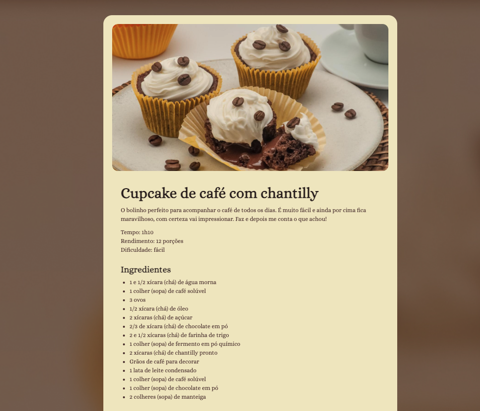

# ☕ Cupcake de Café com Chantilly

This is a simple and beautiful recipe page built as part of the **Rocketseat Fullstack Bootcamp**. The goal was to apply basic HTML and CSS knowledge to build a visually appealing recipe card for a delicious coffee cupcake with whipped cream.

🔗 **[Live Preview](https://eugeniobarrosjr.github.io/recipe-page/)**

## 📸 Preview

<p align="center">
  
</p>

## 🧁 About the Project

This page displays a recipe for a coffee cupcake with Chantilly, perfect to accompany your daily coffee. It's a great exercise to practice semantic HTML, layout, and styling with pure CSS.

### Features

- Responsive layout
- Highlighted ingredients and steps
- Soft and cozy color palette
- Uses semantic HTML elements

## 🛠️ Tech Stack

- HTML5
- CSS3

## 📂 Getting Started

To run this project locally:

```bash
git clone https://github.com/eugeniobarrosjr/recipe-page.git
cd recipe-page
open index.html
```

## 📃 License

This project is licensed under the MIT License.
